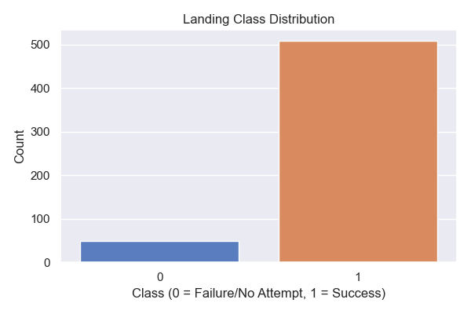
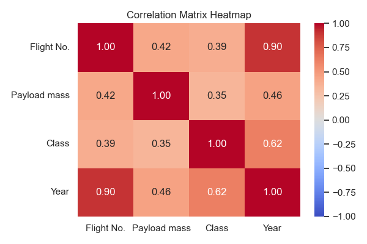
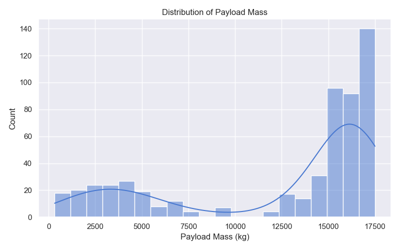
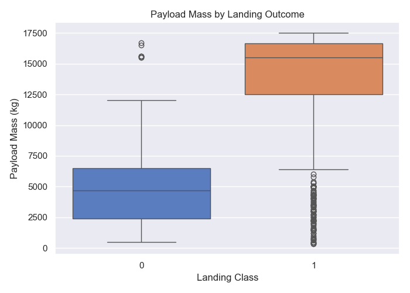
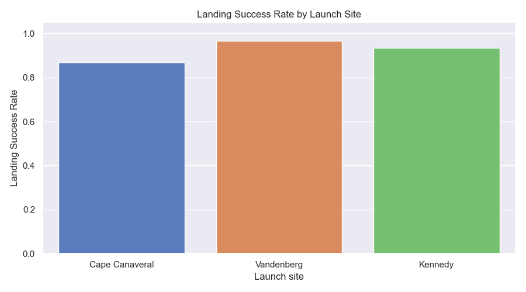
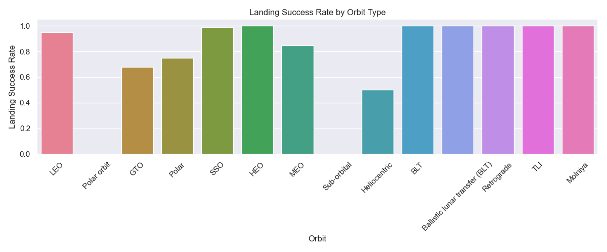
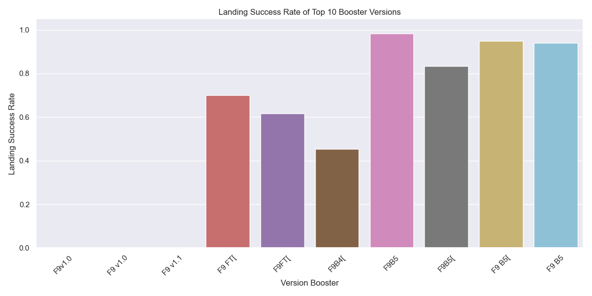
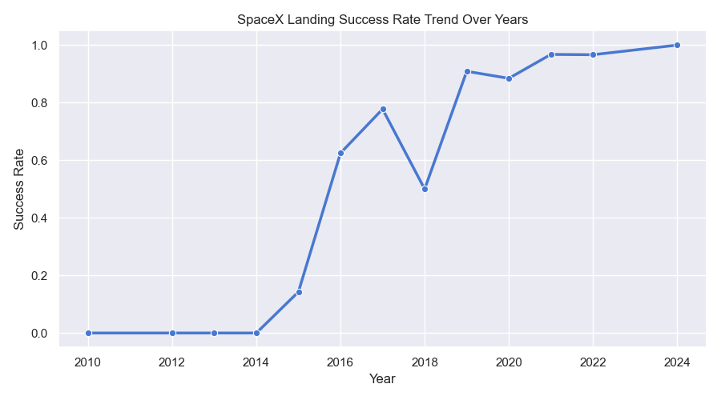
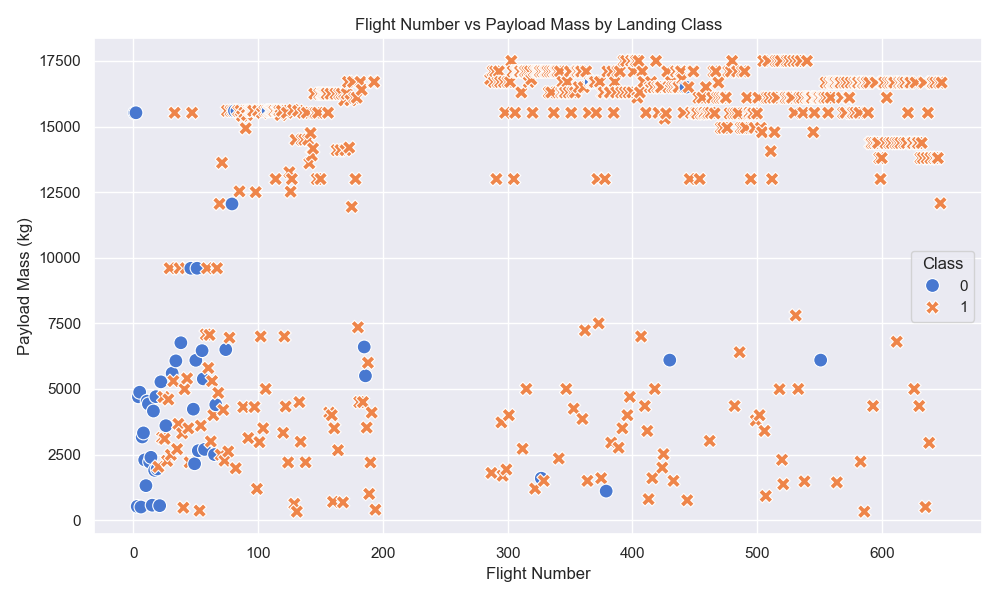

# SpaceX Falcon 9 Landing Prediction - Full EDA Report

This report presents the full exploratory data analysis (EDA) as specified in the project requirements.

## 1. Dataset Profile
- **Shape:** 557 rows, 11 columns
- **Duplicates:** 0 duplicate records

### Data Types & Missing Values:
| Column Name | Non-Null Count | Null Count | Data Type |
| --- | --- | --- | --- |
| `Flight No.` | 557 | 0 | int64 |
| `Launch site` | 557 | 0 | object |
| `Payload` | 554 | 3 | object |
| `Payload mass` | 557 | 0 | float64 |
| `Orbit` | 555 | 2 | object |
| `Customer` | 542 | 15 | object |
| `Launch outcome` | 557 | 0 | object |
| `Date` | 557 | 0 | object |
| `Time` | 557 | 0 | object |
| `Version Booster` | 557 | 0 | object |
| `Booster landing` | 557 | 0 | object |
| `Class` | 557 | 0 | int64 |
| `Year` | 195 | 362 | float64 |

### Summary Statistics:
|        |   Flight No. | Launch site    | Payload   |   Payload mass | Orbit   | Customer   | Launch outcome   | Date          | Time   | Version Booster   | Booster landing   |      Class |       Year |
|:-------|-------------:|:---------------|:----------|---------------:|:--------|:-----------|:-----------------|:--------------|:-------|:------------------|:------------------|-----------:|-----------:|
| count  |      557     | 557            | 554       |         557    | 555     | 542        | 557              | 557           | 557    | 557               | 557               | 557        |  195       |
| unique |      nan     | 3              | 197       |         nan    | 14      | 69         | 3                | 508           | 466    | 18                | 18                | nan        |  nan       |
| top    |      nan     | Cape Canaveral | Starlink  |         nan    | LEO     | SpaceX     | Success          | March 4, 2024 | 14:20  | F9B5              | Success ( OCISLY  | nan        |  nan       |
| freq   |      nan     | 275            | 332       |         nan    | 382     | 333        | 554              | 3             | 4      | 362               | 180               | nan        |  nan       |
| mean   |      338.305 | nan            | nan       |       12347    | nan     | nan        | nan              | nan           | nan    | nan               | nan               |   0.912029 | 2019.44    |
| std    |      198.266 | nan            | nan       |        5728.79 | nan     | nan        | nan              | nan           | nan    | nan               | nan               |   0.283508 |    2.75452 |
| min    |        1     | nan            | nan       |         325    | nan     | nan        | nan              | nan           | nan    | nan               | nan               |   0        | 2010       |
| 25%    |      140     | nan            | nan       |        6100    | nan     | nan        | nan              | nan           | nan    | nan               | nan               |   1        | 2018       |
| 50%    |      370     | nan            | nan       |       15525    | nan     | nan        | nan              | nan           | nan    | nan               | nan               |   1        | 2020       |
| 75%    |      509     | nan            | nan       |       16675    | nan     | nan        | nan              | nan           | nan    | nan               | nan               |   1        | 2022       |
| max    |      648     | nan            | nan       |       17500    | nan     | nan        | nan              | nan           | nan    | nan               | nan               |   1        | 2024       |

## 2. Visualizations and Key Insights

### 2.1 Landing Class Distribution
We derived the landing outcome from the raw `Booster landing` column. Success is designated as 1, Failure/No Attempt as 0.

### 2.2 Numerical Relationships (Correlation Heatmap)

### 2.3 Payload Mass Distribution

### 2.4 Landing Success Rate Analyses
#### By Launch Site:

#### By Orbit Type:

#### By Booster Version (Top 10):

#### Yearly Trend:

### 2.5 Flight Number vs Payload Mass Scatter Plot

